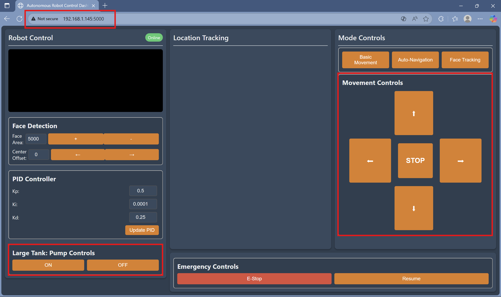
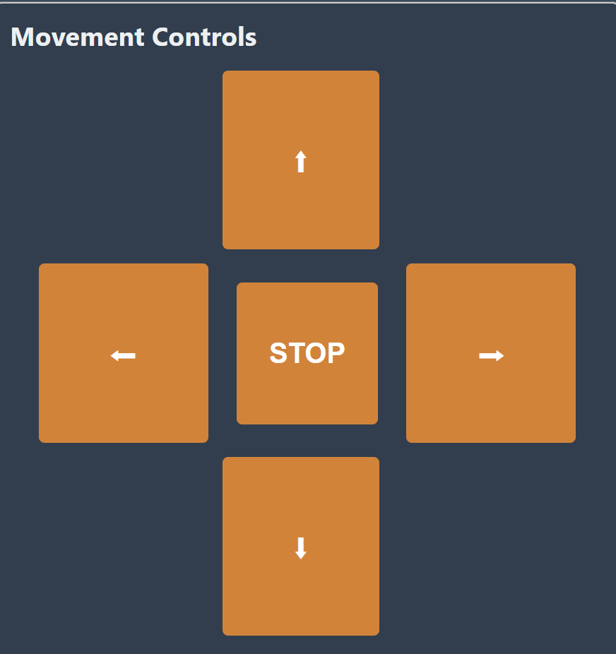

# Overview
This 106 robot is designed specifically for agricultural applications. Its primary function is to serve as a mobile tank and irrigation system, capable of transporting and dispensing water or other liquids as needed. The robot features a [basic control system](#User-Controls) that enables reliable operation in various field conditions, making it a practical tool for supporting farm-level automation and improving irrigation efficiency. 

**IMPORTANT**: accommodated for Raspberry's Thonny (Python IDE) and the FlySky FS-i6X(controller).
### Features
- Basic Movement
- Pump Controls
- Website Features:
  - Autonomous Movement **(In Development)**
  - GPS Tracking
  - Camera View

## User Controls
### Using the Remote Control
For the Remote control we utilize **4 inputs**:

  **IMPORTANT**: When turning on the power-switch all other switches must be facing up.
<p align="center">

</p>

#### Power-switch: 
Located at the bottom-right of the controller. This is what turns on/off the controller.
#### Armed-switch: 
Located as the first switch at the top of the controller. This is the safety switch that allow to use the components.
  - Labeled as: **SWA** 
  - Armed ON: is switch up(100)
  - Armed OFF: is switch down(0)
#### Mode-switch: 
Located as the second switch at the top of the controller. Allows who has priority of the robot, Either Controller or Website but not both.
  - Labeled as: **SWB**
  - Mode Controller: is switch up(100)
  - Mode Website:    is switch down(0)
#### Pump-switch: 
Located as the fourth switch at the top of the controller. This is what turns on/off the pump.
  - Labeled as: **SWD**
  - Pump ON: is switch up(100)
  - Pump OFF: is switch down(0)
#### Movement-Stick: 
Located at the middle-right of the controller. It is a joystick that control the movements of the robot. 

### Using the Website Interface
To be able to use the GUI we must first connect to its WiFi connection
#### WiFi and Connections
- **WiFi name**: downRobotRoom
- **Password**:  robotsRcool

Since the robot's GUI website runs on a local server created by the Raspberry Pi we just use this link:
**http://192.168.1.145:5000/**


#### User Interface
<p align="center">

</p>

**Important**: Connect to the WiFi [downRobotRoom](#WiFi-and-Connections) first before accessing the website(**http://192.168.1.145:5000/**). To allow website access to the robot components, we must interact with the [controller](#user-controls) by switching its mode to website.

#### Movement Buttons: 
Located at the middle-right of the website and marked as movement controls, its the interface for movement control.
<p align="center">

</p>

The Five buttons can be control by certain keys as well:
- **Forward**: "w" key
- **Reverse**: "s" key
- **Left**: "a" key
- **Right**: "d" key
- **Stop**: spacebar key 
#### Pump ON/OFF Buttons: 
Located at the bottom-left of the screen, two buttons that control the pumps.
<p align="center">

</p>


## 106 Robot Control System 
This are all software components that relate to the **106 robot**.
```  
  Arduino/
  ├── ESP32_DEV_CONTROLS.ino
  ├── libraries
  Raspberry/
  ├── main.py
  ├── GUI.py
  ├── IMU.py
  ├── face_tracking.py
  ├── auto_navigation.py
  requirements.txt
```

## Arduino Component
This is the software that relates to our **ESP32**. Its the **Central Control System** for every component to the robot.
Recieves commands from:
- Remote Control (Ibus/FlySky FS-i6X)
- Raspberry Web User Interface
Sends commands to:
- Motors for movement control
- Relay for Pump toggle

### Setup For editing
If any editing must be done to the ESP32 then:
- Arduino IDE most be downloaded
- The appropiate libraries need to be downloaded(Given in the library folder):
  - IBusBM (v.2.0.18-arduino.5)
  - PubSubClient (v.2.0.6)
  - roboclaw_arduino_library-master
- The board "esp32" by Espressif System at version 2.0.6 must be install.

**Important**: The libraries should not be always be at their latest version, but the specified version detailed here.

Then to actually upload any code you must connect the ESP32 (WARNING: THE ROBOT or ESP32 must be off). Applied "esp32 dev1" board and hit send.

Video if needed: https://www.youtube.com/watch?v=CD8VJl27n94&t=225s

## Raspberry Component

#### Getting Started 
To make use of the Raspberry Pi without trying to play with it directly we can access it virtually with our own devices.
1. First we must be connected to the same wifi.
    - **WiFi name**: downRobotRoom
    - **Password**:  robotsRcool

2. Second we must enter our own computers terminal, within it we input the code:

```
bash
ssh ormo-bot@192.169.1.145
Password: Robot

```
3. Third is up to the developer to edit. A full explanation on how to use ssh is lengthy, here is a playlist explaining how to use it.

[Using SSH to access Raspberry PI](https://www.youtube.com/watch?v=aCGbQB8K8T8&list=PLg8DhjCcwNIUJHBY2gwcLh3A9UxUwOROL)
